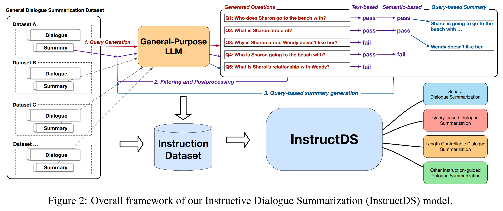
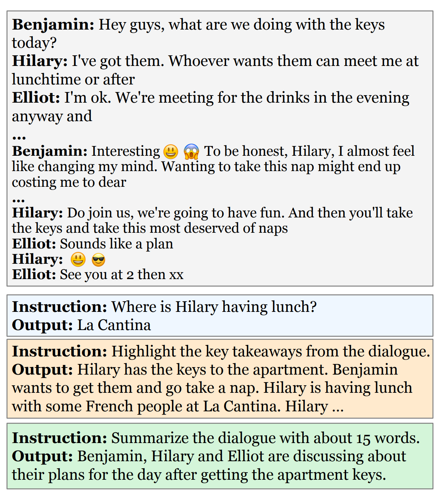

# InstructDS
This is the repo for **[EMNLP 2023: Instructive Dialogue Summarization with Query Aggregations](https://arxiv.org/abs/2310.10981)**




## Requirements
Python = 3.10 (tested)
```
pip install -r requirements.txt
```


The main contributions:
1. Release of Data
   1. SAMSum
   2. SAMSum_QDS (ours)
   3. DialogSum (ours with name replacement)
   4. DialogSum_QDS (ours)
   5. TODSum
   6. TODSum_QDS (ours)
   7. DREAM


2. Traned Model
   1. Our model is trained from Flan-T5-XL.
   2. The model is uploaded and accessible from [HuggingFace](https://huggingface.co/binwang/InstructDS/blob/main/README.md).


3. Demo of Instruvtive Summarization
   ```
   bash demo.sh
   ```
   GPU with 24G memory (recommended)

4. Demo of Summarization

    [YouTube Video]() (coming soon)




### Citation
```
@inproceedings{instructds,
  title={Instructive Dialogue Summarization with Query Aggregations},
  author={Anonymous},
  booktitle={EMNLP},
  year={2023}
}
```