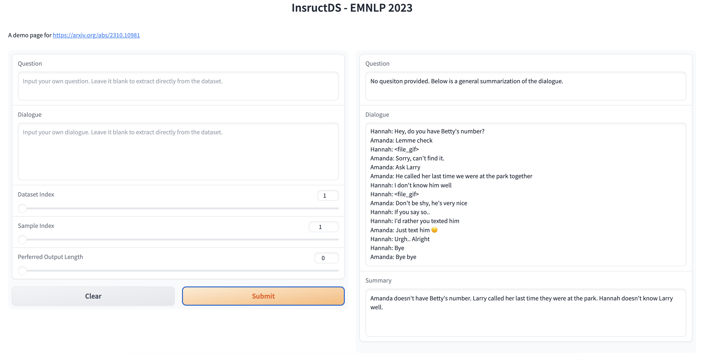

# InstructDS: Instructive Dialogue Summarization with Query Aggregations

This is the repo for **[EMNLP 2023 Dialogue Summarization Work](https://arxiv.org/abs/2310.10981)**

This part is for `demo`. The training and evaluation part can be found at: [InstructDS Train](https://github.com/BinWang28/InstructDS_Train)


<p align="center">
  
</p>

# Framework

<p align="center">

</p>

## Requirements
python 3.10

```
pip install -r requirements.txt
```


The main contributions:
1. Release of Data
   1. SAMSum
   2. SAMSum_QDS (Ours)
   3. DialogSum (Ours with name replacement)
   4. DialogSum_QDS (Ours)
   5. TODSum
   6. TODSum_QDS (Ours)
   7. DREAM


2. Traned Model
   1. Our model is trained from Flan-T5-XL.
   2. The model is uploaded and accessible from [InstructDS](https://huggingface.co/binwang/InstructDS/blob/main/README.md).


3. Demo of Instruvtive Summarization
   ```
   bash demo.sh
   # A100 GPU with 40G memory: Pass
   # A5000 GPU with 24G memory: Pass
   ```

4. Demo Page (You can run locally.)

  <p align="center">
   
  </p>


   Fore more information, please refer to [Slides for Demo](content/demo_slides.pdf), [Paper](https://arxiv.org/abs/2310.10981), and [Poster](content/poster.pdf).

<p align="center">

</p>

## Citation
```
@inproceedings{wang-etal-2023-instructive,
    title = "Instructive Dialogue Summarization with Query Aggregations",
    author = "Wang, Bin  and
      Liu, Zhengyuan  and
      Chen, Nancy",
    editor = "Bouamor, Houda  and
      Pino, Juan  and
      Bali, Kalika",
    booktitle = "Proceedings of the 2023 Conference on Empirical Methods in Natural Language Processing",
    month = dec,
    year = "2023",
    address = "Singapore",
    publisher = "Association for Computational Linguistics",
    url = "https://aclanthology.org/2023.emnlp-main.474",
    pages = "7630--7653",
}
```

```
@misc{wang2023instructive,
      title={Instructive Dialogue Summarization with Query Aggregations}, 
      author={Bin Wang and Zhengyuan Liu and Nancy F. Chen},
      year={2023},
      eprint={2310.10981},
      archivePrefix={arXiv},
      primaryClass={cs.CL}
}
```
